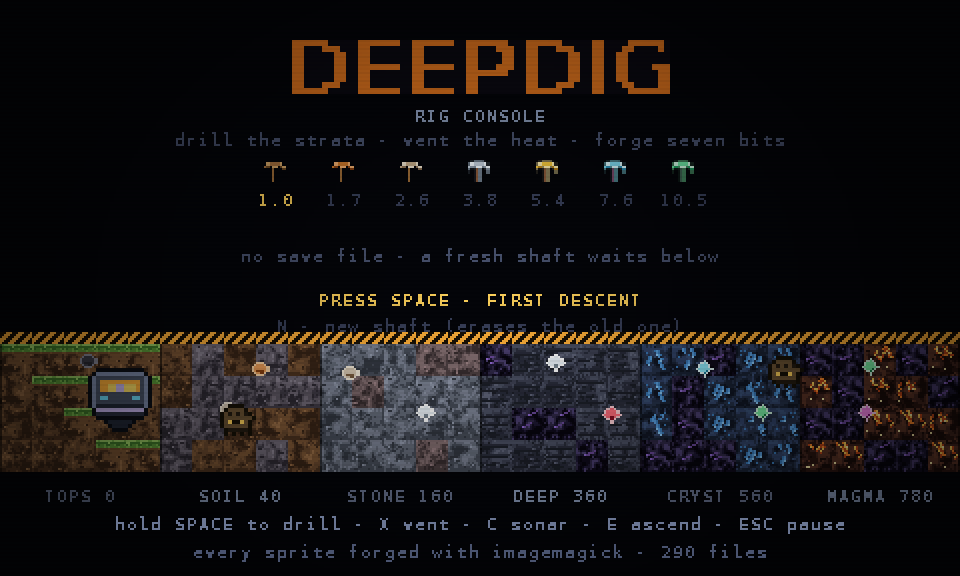
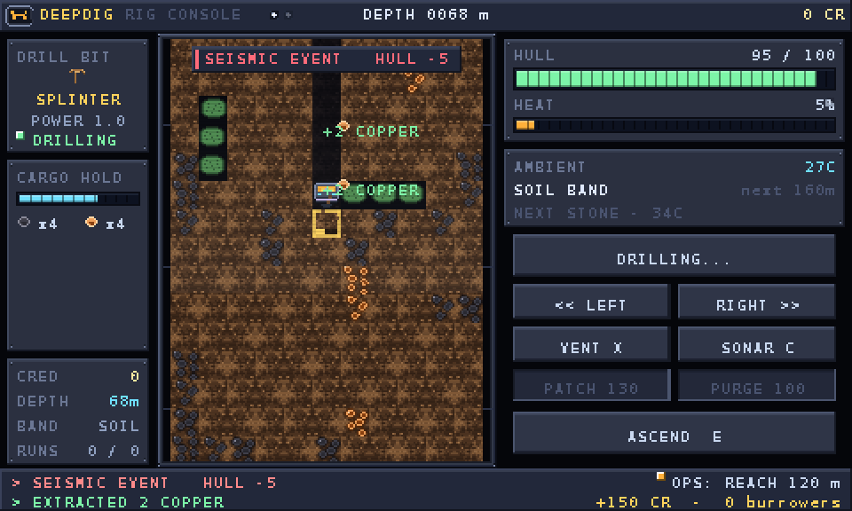
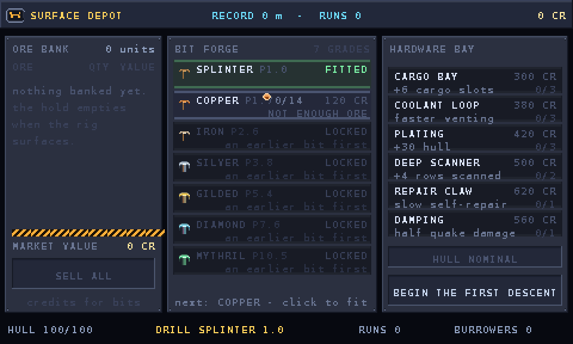
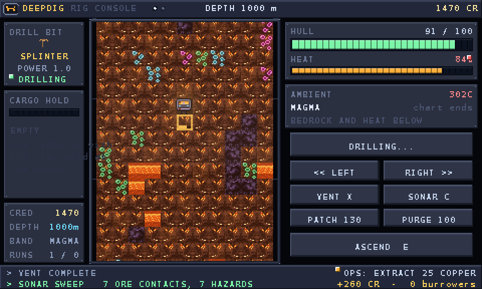

# DEEPDIG

A 2D pixel game about **operating a mining rig** — not about walking around one.
You sit at a control console: a borehole viewport in the middle, gauges and
buttons on the right, the drill bit and cargo hold on the left, a ticker of
machine chatter along the bottom. You never control a miner; you run a machine.

Drill the strata, keep the coolant loop ahead of the heat, watch the hull,
flush the burrowers out of the borehole, haul ore up the winch and forge
**seven drill bits** on the way to the core:

`Splinter → Copper → Iron → Silver → Gilded → Diamond → Mythril`

Everything is vanilla JavaScript + canvas. **Every single pixel is authored in
this repo and rasterised by ImageMagick** — no downloaded art, no sprite sheets,
no asset packs. See [How the art is made](#how-the-art-is-made).

| | |
| --- | --- |
|  |  |
|  |  |

*Real frames — rendered by `tools/preview.py`, which replays the game's own
canvas calls (see [QA harness](#qa-harness)).*

## Play

```bash
python3 -m http.server 8000     # any static server will do
# open http://localhost:8000
```

**On a phone or tablet the game grows a deck.** Anything with a coarse pointer —
or any device where a finger actually touches the screen — gets a modern touch
panel under the glass: DEPTH, CREDITS and live HULL/HEAT bars, a big amber
**DRILL** button you hold, `‹‹` / `››` steer pads that repeat while held, and
VENT / SONAR / PATCH / PURGE / ASCEND. The deck follows the game state: at the
depot it becomes SELL ALL, **FIT BIT** (priced with the ore and credits the next
grade needs), **REPAIR HULL** and DESCEND, plus a generated button for every row
of the hardware bay; on the title it becomes START SHIFT, and when the rig comes
apart it becomes REBUILD. Every control is at least 46 px tall, sits above the
safe-area inset, and greys itself out when the console would refuse it.

Portrait puts the deck under the glass; landscape moves it beside the glass so
the picture keeps the full height. Everything is reachable with two thumbs:
**hold DRILL with one, steer with the other**, and any finger held on the
borehole itself drills too. Add it to your home screen (Share → *Add to Home
Screen*) and it launches fullscreen from the generated icon — there is no
service worker and no network call after load, so the page is the whole game.

Trying it on a desktop? `?touch=1` forces the deck on, `?touch=0` hides it.

| Action | Key / input |
| --- | --- |
| drill (hold) | `SPACE`, **hold the mouse on the borehole**, or the `HOLD TO DRILL` button |
| steer left / right | `A` / `D` or the `LEFT` / `RIGHT` buttons |
| vent coolant | `X` |
| sonar sweep | `C` |
| field patch (+30 hull, 130 CR) | `R` |
| coolant purge (-50 heat, 100 CR) | `Q` |
| ascend / deploy | `E` |
| audio on/off | `M` |
| pause / menu | `ESC` |
| new shaft (erases the save) | `N` on the title or pause screen |

Everything the console shows is clickable too: buttons light up on hover, the
forge rows and hardware rows are one-click purchases. On touch, the deck below
the glass mirrors those same commands with finger-sized targets, and the header
button toggles fullscreen.

## The console

```
┌ top bar ─────────────────────────────────────────────────────────────┐
│ badge · DEEPDIG RIG CONSOLE · warning lamps · DEPTH · CREDITS        │
├──────────┬───────────────────────────────────┬───────────────────────┤
│ DRILL BIT│  borehole viewport (bezel glass,   │ HULL / HEAT gauges    │
│ CARGO    │  14 x 11 cells, scanlines, sonar  │ AMBIENT + strata scope│
│ HOLD     │  overlay, depth ticks)            │ HOLD TO DRILL         │
│ CREDITS  │                                   │ LEFT/RIGHT VENT/SONAR │
│ DEPTH/BAND│                                  │ PATCH/PURGE ASCEND    │
├──────────┴───────────────────────────────────┴───────────────────────┤
│ ticker: machine log (2 lines) · current contract · burrower count    │
└──────────────────────────────────────────────────────────────────────┘
```

Between descents you are at the **depot**: an ore bank that sells the hold, the
seven-row **bit forge** (each row prices itself in ore you own), a hardware bay,
a repair bay and the winch that sends you back down — always to your deepest
point, never further than you have actually drilled.

## The loop

1. **Drill down.** Each cell takes time proportional to its hardness divided by
   your bit's power: 1.5 s per cell at 400 m with the Splinter, 0.15 s with
   Mythril. Drilling makes heat and opens the cell — the rock you *did* drill
   stays open, everything else is sealed until you cut it.
2. **Mind the heat.** Ambient rock heat leaks in with depth (12 °C topside,
   168 °C in the magma band) and the bit adds more. Past 100 % the hull starts
   burning, so vent the coolant loop before it cooks you. Venting also flushes
   burrowers off the hull.
3. **Mind the hold.** Ore rides up with the rig: a 12-slot hold, upgradeable to
   30. A full hold means ascending, because everything you drilled that did not
   fit stayed in the rock.
4. **Hazards bite.** Gas pockets cost 11 hull, lava veins 15 hull and 34 heat,
   seismic events shake 3–9 hull off, and burrowers chew the hull until you
   vent them off or drill through them.
5. **Sell, forge, repeat.** Banked ore pays for the next bit — `14 copper`,
   `18 iron`, `20 silver`, `18 gold + 10 ruby`, `20 diamond`,
   `18 mythril + 10 coreium` — plus hardware: cargo bays, coolant loops,
   plating, a deep scanner, a repair claw and earthquake damping.
6. **Lose the rig, keep the shaft.** A wreck loses the hold (and any ore in it)
   but never your credits, bits, hardware or the drill shaft: you redeploy from
   the depot and the winch drops you back to your record depth.

## The world

The rock is not stored — it is a pure function of `(x, y, seed)`, so the shaft
is effectively endless and the save file only carries the cells you opened.

| Band | from | rock | ambient | ores |
| --- | --- | --- | --- | --- |
| TOPSOIL | 0 m | regolith | 12 °C | coal, copper |
| SOIL BAND | 40 m | soil | 18 °C | coal, copper, iron |
| STONE | 160 m | stone (granite pockets) | 34 °C | copper, iron, silver |
| DEEPSLATE | 360 m | deepslate | 64 °C | silver, gold, ruby |
| CRYSTAL | 560 m | crystal (obsidian pockets) | 105 °C | gold, ruby, diamond, mythril |
| MAGMA | 780 m | magma | 168 °C | diamond, mythril, coreium |

Ore values: coal 5 · copper 9 · iron 16 · silver 26 · gold 42 · ruby 62 ·
diamond 95 · mythril 145 · coreium 225 credits per unit — and the densities are
tuned with `node tools/headless.js --script=balance`, which prints exactly how
much of every band carries ore and hazards.

## The seven bits

| # | Bit | Forged from | Credits | Power |
| --- | --- | --- | --- | --- |
| 0 | Splinter | — | — | 1.0 |
| 1 | Copper | 14 copper | 120 | 1.7 |
| 2 | Iron | 18 iron | 320 | 2.6 |
| 3 | Silver | 20 silver | 700 | 3.8 |
| 4 | Gilded | 18 gold + 10 ruby | 1400 | 5.4 |
| 5 | Diamond | 20 diamond | 2600 | 7.6 |
| 6 | Mythril | 18 mythril + 10 coreium | 4200 | 10.5 |

You can only fit the next grade in sequence — the forge shows every row, and
prices the one you can actually buy.

## How the art is made

```
tools/artgen.py      canvas + pixel-map parser + rock generator + ImageMagick passes
tools/gen_tiles.py   terrain, ores, crystal, obsidian, magma, lava, gas
tools/gen_sprites.py the seven pickaxe icons, ore chunks, the rig, burrowers
tools/gen_font.py    95-glyph bitmap font atlas + 18 pre-tinted "ink" atlases
tools/gen_ui.py      slots, panels, cursor, hearts, logo, glow
tools/gen_ui2.py     console chrome: bezels, plates, buttons, gauges, LEDs, arrows
tools/gen_rig.py     the rig, burrowers, hazard stripes, scanlines, glare
tools/gen_bg.py      vignette and backdrops
tools/build_assets.sh  rebuilds all 290 PNGs and writes js/assetlist.js
```

Three techniques, all ImageMagick:

* **Hand-placed pixel maps.** Sprites are written as ASCII grids
  (`"h" = hull light`, `"." = transparent`) and turned into run-length `-draw`
  rectangles. The rig, every drill bit, the burrowers and every ore chunk are
  authored this way.
* **Procedural rock.** Smoothed value noise is quantised onto per-strata ramps,
  then given chipped pits, glints and a broken top-lit bevel, so a wall of
  variants never reads as a picture-frame grid. The sampling runs in Python,
  the pixels still come out of `convert`.
* **ImageMagick passes.** Glows (alpha dilate → colour mask), drilled-out wall
  tiles (`-modulate` + `-colorize`), the tinted font atlases
  (`-fill … -colorize 100`, keeping glyph alpha), hazard stripes, scanlines and
  the tube glare are all `convert` operations.

Text has no runtime tinting: the font is forged once per ink
(paper, amber, mint, rose, …) so the renderer only ever blits ready-made
atlases — which also means the QA replayer sees exactly what the player sees.

Every asset is regenerable: `bash tools/build_assets.sh`.

## Project layout

```
index.html            canvas + boot screen + the touch deck markup
style.css             the shell: stage, loading veil, and the responsive deck
manifest.webmanifest  installable-app manifest (icons forged by tools/gen_icons.sh)
js/core.js            math, noise, input (keys, mouse, multi-touch), WebAudio synth
js/assets.js          image loader (no fetch -> also runs from file://)
js/assetlist.js       generated manifest of every PNG
js/well.js            the rock: strata, ore veins, hazards, sonar, as pure functions
js/rig.js             the machine: drill, heat, hull, cargo, grubs, quakes, contracts
js/ui.js              immediate-mode widgets: plates, gauges, buttons, slots, LEDs
js/console.js         the console screen: viewport, panels, controls, alerts, ticker
js/depot.js           the surface screen: ore bank, bit forge, hardware bay, winch
js/render.js          frame dispatch + title / pause / wreck screens
js/game.js            state machine, transitions, save/load, screen effects
js/touch.js           the deck: pure view model + the DOM that paints it
js/main.js            boot, responsive canvas scaling, the fixed-step loop
assets/               290 PNGs, all generated (safe to delete and rebuild)
tools/                the art forge + the QA harness
.github/workflows/    QA gate + the two-way GitHub Pages publish
```

## QA harness

There is no browser in the build sandbox, so the game is tested headlessly —
and screenshotted by replaying its own draw calls:

```bash
bash tools/test.sh                                             # the whole suite
node tools/headless.js --frames=2400 --script=surfaces         # simulate a full shift
node tools/headless.js --script=systems                        # 56 assertions
node tools/headless.js --script=balance                        # ore/hazard densities
node tools/headless.js --frames=400 --script=mine --out=/tmp/scene.json
python3 tools/preview.py /tmp/scene.json shot.png --scale=2     # 480x288 -> 960x576
```

* `tools/headless.js` runs the real `js/` files in a Node VM against a stubbed
  2D context that throws on `drawImage(null)` or non-finite geometry. It also
  audits the **inks**: every text colour the frame prints must have a forged
  atlas, and every asset it asks for must exist.
* `--script=touch` drives the deck exactly the way thumbs do — it presses
  DRILL, steers with the second finger, taps VENT, holds two fingers on the
  glass at once, then sells the haul, fits a bit, repairs the hull and buys a
  cargo bay from the depot pad, asserting that every credit moved by exactly
  the price printed on the button. It also fails the build if the page ships a
  `data-act` the code does not know, or if a hardware row has no button.
* `--script=systems` asserts the whole machine: deterministic rock, monotonic
  strata heat, strictly stronger bits, forge gating and consumption, drilling
  and descent, cargo caps, hazard damage, venting, sustained overheat damage,
  burrower chewing and flushing, lateral movement, selling, contracts, hardware
  tiers, repairs, surfacing, the winch returning to the record depth, wrecking,
  redeploying, save/reload round-trips, and that all six screens render.
* `--script=balance` prints the ore and hazard density of every band, plus the
  seconds a given bit needs on a cell at 400 m and 1800 m — the tuning table.
* The harness reads the script order straight out of `index.html`, so a
  load-order mistake cannot hide from the tests.
* `tools/replay.py` is a dependency-free PNG engine (decoder *and* encoder) that
  rasterises the recorded frame — transforms, clips, alpha, mirrored tiles and
  all — so screenshots need neither a browser nor an image library.
* `tools/preview.py` wraps it, with `--scale=N` for the README shots.

## Deploy

`.github/workflows/pages.yml` publishes the game to GitHub Pages on every push:

1. the **QA job** runs `tools/test.sh` — nothing is published that has not
   passed the whole suite;
2. the **publish job** stages `index.html`, `style.css`, `manifest.webmanifest`,
   the four icons, `.nojekyll`, `js/` and `assets/` (1.5 MB, 310 files — no
   build step, no bundler, nothing to invalidate), then publishes that folder
   **both ways** GitHub Pages accepts:
   * through the Pages API (`upload-pages-artifact` + `deploy-pages`), which is
     what *Source: GitHub Actions* serves, and
   * as a mirror of the same folder on the `gh-pages` branch, which is what
     *Source: Deploy from a branch* serves.

Whichever source the repository is set to, one of the two lands the site, so
there is no repository setting that has to be flipped for a push to publish —
and if Pages is switched off entirely the run says so in its summary instead of
failing silently. The game lives at <https://arthurowgg.github.io/aitest/>.

Everything uses relative paths, so it works unchanged from a project subpath,
and `python3 -m http.server` is all you need locally.

## Performance notes

* 480×288 internal canvas: whole- or half-multiple scaling on desktop, exact
  fit on phones (where the screen is smaller than the game), always
  `image-rendering: pixelated`.
* ~900–1300 canvas calls per frame (see any `headless.js` run) — only the cells
  inside the glass are drawn, and the rock is cached per frame.
* Assets are ~1.2 MB total (290 PNGs, 16×16-ish); the deployed site is ~1.9 MB.
* The touch deck repaints at 15 Hz through a diffs-only view model, and only
  ever touches the DOM when a chip, bar or button actually changes.
* Fixed 1/60 s timestep with an accumulator, max 6 catch-up steps per frame.

## Licence

The code and the generated art in this repository are yours to use. The bitmap
font atlas is rasterised from DejaVu Sans Mono Bold, which ships with
ImageMagick's font set.
