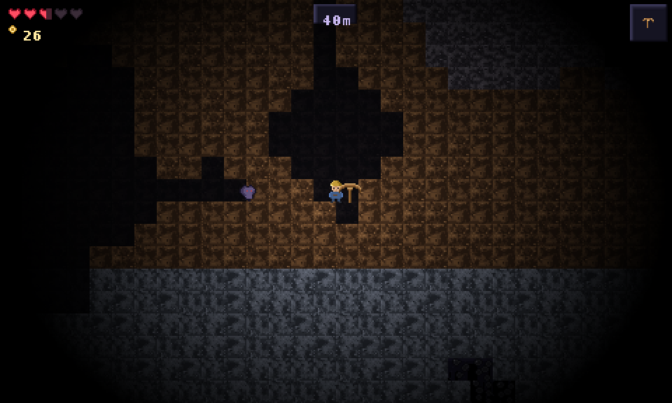
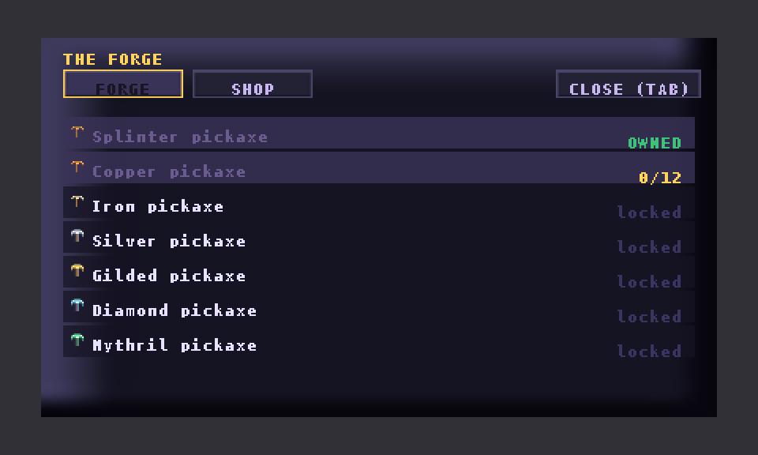

# ⛏ DEEPDIG

A 2D pixel mining game. Dig from the grass line down to the core of the world,
fight what lives in the dark, and forge **seven pickaxes** on the way —
`Splinter → Copper → Iron → Silver → Gilded → Diamond → Mythril`.

Everything is vanilla JavaScript + canvas. **Every single pixel in the game is
authored in this repo and rasterised by ImageMagick** — there is no downloaded
art, no sprite sheets, no asset packs, no image-generating service. The terrain
is procedural noise quantised onto hand-picked colour ramps; the characters,
pickaxes, ores and furniture are hand-placed pixel maps. See
[How the art is made](#how-the-art-is-made).

```
    ██████╗ ███████╗███████╗██████╗ ██████╗ ██╗ ██████╗
    ██╔══██╗██╔════╝██╔════╝██╔══██╗██╔══██╗██║██╔════╝
    ██║  ██║█████╗  █████╗  ██████╔╝██║  ██║██║██║  ███╗
    ██║  ██║██╔══╝  ██╔══╝  ██╔═══╝ ██║  ██║██║██║   ██║
    ██████╔╝███████╗███████╗██║     ██████╔╝██║╚██████╔╝
    ╚═════╝ ╚══════╝╚══════╝╚═╝     ╚═════╝ ╚═╝ ╚═════╝
```

| | |
| --- | --- |
|  |  |
|  |  |

*Real frames — produced by `tools/test.sh` / `tools/preview.py`, which run the
actual game code and composite the frame through ImageMagick.*

## Play

```bash
python3 -m http.server 8000     # any static server will do
# open http://localhost:8000
```

| Action | Key / input |
| --- | --- |
| walk | `A` `D` / `←` `→` |
| jump | `SPACE` / `W` / `↑` (tap again for a short hop) |
| mine / swing | hold **left mouse** toward what you want to hit |
| bomb | `B` |
| forge & shop | `E` or `TAB` |
| quick-forge the next pickaxe | `F` (in game or shop) |
| warp to camp | `T` |
| sound on/off | `M` |
| pause | `ESC` |

Touch devices get a left-half thumbstick, a right-half aim/mine area and
`JUMP` / `BOMB` / `BAG` buttons.

## The loop

1. **Mine the six strata.** Soil → Stone → Deepslate → Crystal → Magma, each
   with its own rock, hardness, ores and hazards.
2. **Spend ore, not just coins.** Every pickaxe is forged from the ore of the
   layer you just cracked open: copper for the copper pick, iron for the iron
   pick, and so on to `22 mythril + 8 coreium` for the last one. Coins buy
   bombs, hearts, a lantern, boots, soft soles and an ore magnet.
3. **Watch the gate.** Rock under your pickaxe tier can still be broken, just
   slowly — but *ore* under your tier refuses outright ("silver needs an Iron
   pickaxe"). That is what makes the next pickaxe the goal.
4. **The dark gets darker.** Light falls off with depth; only your helmet lamp,
   glowing crystal, magma, lava and the odd twinkle of nearby ore push it back.
   Bats, hop-snapping emberlings and slow, tanky golems spawn out of sight.
5. **Die and keep your forge.** Death respawns you at camp with your pickaxes
   and upgrades intact. The world is saved (only the tiles you changed) every
   12 seconds and on key moments.

The world is 384×256 tiles of procedurally generated strata, caves, worms,
ore veins and lava pools, seeded per run.

## The seven pickaxes

| # | Pickaxe | Forged from | Power | Speed | Reach |
| --- | --- | --- | --- | --- | --- |
| 0 | Splinter (wood) | — | 1 | 1.0 | 2.6 |
| 1 | Copper | 10 copper | 2 | 1.35 | 2.8 |
| 2 | Iron | 18 iron | 3 | 1.7 | 3.0 |
| 3 | Silver | 26 silver | 4 | 2.1 | 3.2 |
| 4 | Gilded | 20 gold + 10 ruby | 6 | 2.9 | 3.5 |
| 5 | Diamond | 24 diamond | 8 | 3.6 | 3.8 |
| 6 | Mythril | 22 mythril + 8 coreium | 11 | 4.4 | 4.2 |

Higher tiers also mine the soft strata faster, reach further, and hit monsters
harder (pickaxe power doubles as weapon damage).

## How the art is made

```
tools/artgen.py      canvas + pixel-map parser + rock generator + ImageMagick passes
tools/gen_tiles.py   terrain, ores, crystal, obsidian, magma, lava
tools/gen_sprites.py the miner, all seven pickaxes, monsters, loot, particles, props
tools/gen_font.py    95-glyph bitmap font atlas (ImageMagick-rendered, cropped to cells)
tools/gen_ui.py      panels, slots, buttons, cursor, thumbstick, lamp glow, logo
tools/gen_bg.py      seamless parallax cave silhouettes + vignette
tools/build_assets.sh  rebuilds all 238 PNGs and writes js/assetlist.js
```

Three techniques, all ImageMagick:

* **Hand-placed pixel maps.** Sprites are written as ASCII grids
  (`"H" = helmet`, `"." = transparent`) and turned into run-length `-draw`
  rectangles. The miner, every pickaxe crescent, every monster and every ore
  cluster is authored this way.
* **Procedural rock.** Smoothed value noise (2–3 octaves) is quantised onto a
  five-colour ramp that is nudged per variant, then given chipped pits, glints
  and a *broken* top-lit bevel — so a wall of 12 stone variants never reads as a
  picture-frame grid. Simulating all of it in `convert` alone produced
  rectangular banding, so the grid is composed in Python and rasterised by
  ImageMagick: the pixels still come out of `convert`.
* **ImageMagick passes.** Glows (alpha dilate → colour mask → `DstOver`), the
  dimmed behind-wall tiles (`-modulate` + `-colorize`), rolled lava frames
  (`-roll`), the logo (point-downscale → 3× upscale → gradient CLUT) and the
  lamp vignette (`radial-gradient`) are all `convert` operations.

Every asset is regenerable: `bash tools/build_assets.sh`.

## Project layout

```
index.html            canvas + boot screen
style.css             page furniture (the game is 100% canvas)
js/core.js            math, noise, input (keyboard/mouse/touch), WebAudio synth, storage
js/assets.js          image loader (no fetch → also runs from file://)
js/assetlist.js       generated manifest of every PNG
js/world.js           tile table, strata generation, caves, ore veins, mining rules, save mods
js/entities.js        the miner, monsters, particles, drops, floating text
js/render.js          camera, parallax, tiles, entities, lamp lighting, HUD, menus
js/game.js            state machine, mining, combat, forge, shop, save/load, boot loop
assets/               238 PNGs, all generated (safe to delete and rebuild)
tools/                the art forge + the QA harness
```

## QA harness

No browser is available in the build sandbox, so the game is tested headlessly
against a stubbed DOM/canvas:

```bash
bash tools/test.sh                                            # the whole suite
node tools/headless.js --frames=2400 --script=mine            # simulate play
node tools/headless.js --script=systems                       # assert every mechanic
node tools/headless.js --frames=360 --script=sweep            # every asset must resolve
node tools/headless.js --frames=1800 --script=mine --out=/tmp/scene.json
python3 tools/preview.py /tmp/scene.json /tmp/shot.png        # ImageMagick screenshot
```

* `tools/headless.js` runs the real `js/` files in a Node VM with a canvas stub
  that throws on `drawImage(null)` or non-finite geometry — it catches missing
  assets and broken draw calls that a screenshot would hide.
* `--script=systems` is an assertion suite: breaking every rock type, ore tier
  gating, forging all seven pickaxes, the shop, bombs, monster damage, fall
  damage, lethal damage and revive, warp, the bedrock floor, rendering all four
  menu states, and save/reload.
* `--script=sweep` force-draws every tile id, monster, drop, particle kind and
  every menu — then asserts that each sprite the frame asked for actually
  exists (this is how the missing bat sprite was caught).
* The harness reads the script order straight out of `index.html`, so a
  load-order mistake cannot hide from the tests.
* `tools/preview.py` composits a dumped scene with the same strata, parallax,
  lamp-falloff and vignette rules the canvas renderer uses — a faithful
  screenshot of the frame for visual QA.

```bash
node tools/headless.js --frames=600 --script=systems   # ✓ every system check passed
```

## Performance notes

* 480×288 internal canvas, integer-scaled up — `image-rendering: pixelated`.
* Only visible tiles are drawn; lighting is one offscreen canvas with
  `destination-out` lamp holes and cached glow sprites, composited once per
  frame. Particles are capped.
* Assets are ~1 MB total (238 PNGs, 16×16-ish).
* Fixed 1/60 s timestep with an accumulator; `dt` is clamped so tab-switching
  cannot teleport the miner through walls.

## Licence

The code and the generated art in this repository are yours to use. The bitmap
font atlas is rasterised from DejaVu Sans Mono Bold (Bitstream Vera / public
domain-ish licence), which ships with ImageMagick's font set.
